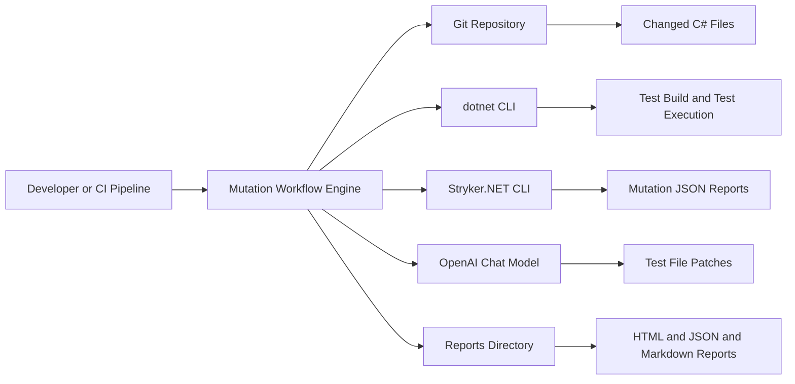
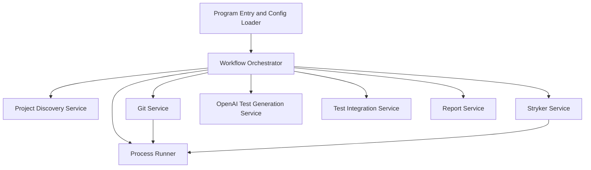
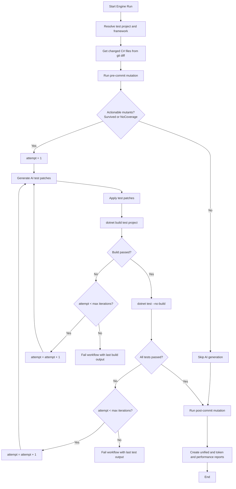
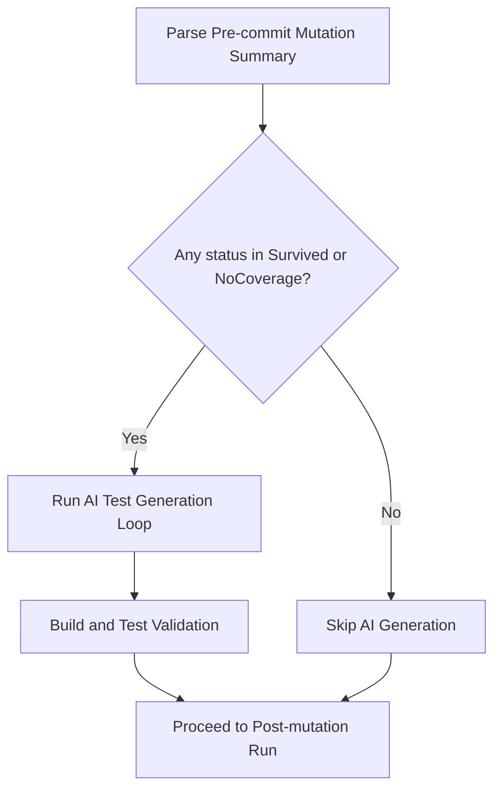

# Mutation Engine - High Level Technical Design

## 1. Purpose
This document provides a high-level architecture and block design for the Mutation Engine, including core workflows and use cases.

The Mutation Engine automates mutation-driven test improvement for changed C# source files by:
- discovering changed files from git diff,
- running pre-mutation analysis with Stryker,
- generating/updating tests with AI when actionable mutants are found,
- validating test quality through build and test execution,
- running post-mutation analysis and producing reports.

## 2. Scope
In scope:
- orchestration flow in the engine,
- integration with git, dotnet, Stryker.NET, and OpenAI,
- report generation (JSON, Markdown, HTML),
- use-case driven behavior for actionable mutants.

Out of scope:
- internals of target product codebase,
- internals of Stryker mutation operators,
- hosting/deployment automation outside local or CI shell execution.

## 3. System Context

## 4. High-Level Block Diagram

## 5. Component Responsibilities
| Component | Responsibility |
|---|---|
| Program | Loads input/config, resolves defaults, wires services, starts workflow |
| Workflow Orchestrator | End-to-end orchestration, retries, timing, control flow decisions |
| Project Discovery Service | Resolves test project path and test framework |
| Git Service | Finds changed source files and optionally commits/pushes generated tests |
| Stryker Service | Runs mutation analysis and parses mutation report JSON |
| OpenAI Test Generation Service | Builds mutation-aware prompts, calls model, parses generated patch JSON |
| Test Integration Service | Maps source files to target test files and applies generated patches |
| Report Service | Writes unified mutation reports, token reports, performance reports, summary HTML |
| Process Runner | Runs external commands with timeout and captured stdout/stderr |

## 6. Core Workflow (End-to-End)
1. Resolve test project and framework.
2. Get changed C# source files from git diff.
3. Run pre-commit mutation analysis.
4. If actionable mutants exist (Survived or NoCoverage), run AI generation with retry (max iterations):
   - generate patches,
   - apply patches,
   - build test project,
   - run tests,
   - retry on build/test failure until max iterations.
5. If no actionable mutants exist, skip AI generation.
6. Run post-commit mutation analysis.
7. Produce unified JSON/Markdown/HTML reports plus token/performance reports.

## 7. Actionable Mutant Decision Flow

## 8. Use Cases to Cover

### UC-01: PR with changed source files and survived mutants
- Trigger: PR modifies source behavior with insufficient assertion strength.
- Expected: Engine generates/updates tests and improves kill ratio.
- Acceptance:
  - AI generation is invoked.
  - Build and test pass before moving forward.
  - Post score is greater than or equal to pre score.

### UC-02: PR with changed source files and no-coverage mutants
- Trigger: New method added without tests.
- Expected: Engine still invokes AI generation due to NoCoverage actionable status.
- Acceptance:
  - AI generation is invoked even if Survived is zero.
  - New/updated tests are applied and validated.

### UC-03: PR with no actionable mutants
- Trigger: Pre summary has only Ignored/Skipped-like statuses with no Survived/NoCoverage.
- Expected: AI generation is skipped.
- Acceptance:
  - No OpenAI call made.
  - Workflow continues to post-mutation and report generation.

### UC-04: AI-generated tests fail build
- Trigger: Patch introduces compile errors.
- Expected: Retry generation until max iterations.
- Acceptance:
  - Build failure captured and surfaced.
  - Final failure throws clear build output when retries exhausted.

### UC-05: AI-generated tests build but fail execution
- Trigger: Tests are flaky or assertion logic wrong.
- Expected: Retry generation until max iterations.
- Acceptance:
  - dotnet test is executed after successful build.
  - Final failure includes test output when retries exhausted.

### UC-06: Commit and push enabled
- Trigger: Config CommitAndPush=true.
- Expected: Generated test files are committed and pushed.
- Acceptance:
  - Commit identity ensured.
  - Files staged and pushed only when updates exist.

### UC-07: Report-only verification
- Trigger: Team needs auditability of run outcomes.
- Expected: Unified JSON/Markdown/HTML with token and timing data.
- Acceptance:
  - Pre/post summaries present.
  - Per-file mutation deltas and mutants list are present.

## 9. Key Data and Artifacts
Inputs:
- input.json / CLI overrides
- git base ref and changed file list
- target project and test project paths

Generated artifacts:
- pre-build mutation report JSON
- post-build mutation report JSON
- unified-mutation-report.json
- unified-mutation-report.md
- token-usage-report.json
- performance-report.json
- MutationSummary.html

## 10. Non-Functional Design Notes
- Reliability: retries for AI generation loop with bounded iteration count.
- Safety: patch path sanitization to avoid path traversal and out-of-repo writes.
- Performance: configurable max concurrency for AI calls.
- Observability: verbose logs, stage timings, token usage reports.
- Timeout control: external process calls run with configurable timeout.

## 11. Risks and Mitigations
- Risk: Mutation statuses may include values beyond Killed/Survived.
  - Mitigation: Treat status mapping explicitly in reports and actionable decision logic.
- Risk: AI produces syntactically valid but behaviorally weak tests.
  - Mitigation: build+test validation and retry loop.
- Risk: no changed source files from git base ref mismatch.
  - Mitigation: fail fast with clear message and configurable base ref.

## 12. Future Design Enhancements
- Introduce dependency injection and interfaces for stronger testability.
- Add first-class engine unit/integration tests for orchestration branches.
- Add dedicated report dimensions for Ignored and NoCoverage rather than lumping into generic skipped categories.
- Add "new mutants vs existing mutants" diff section in report.
